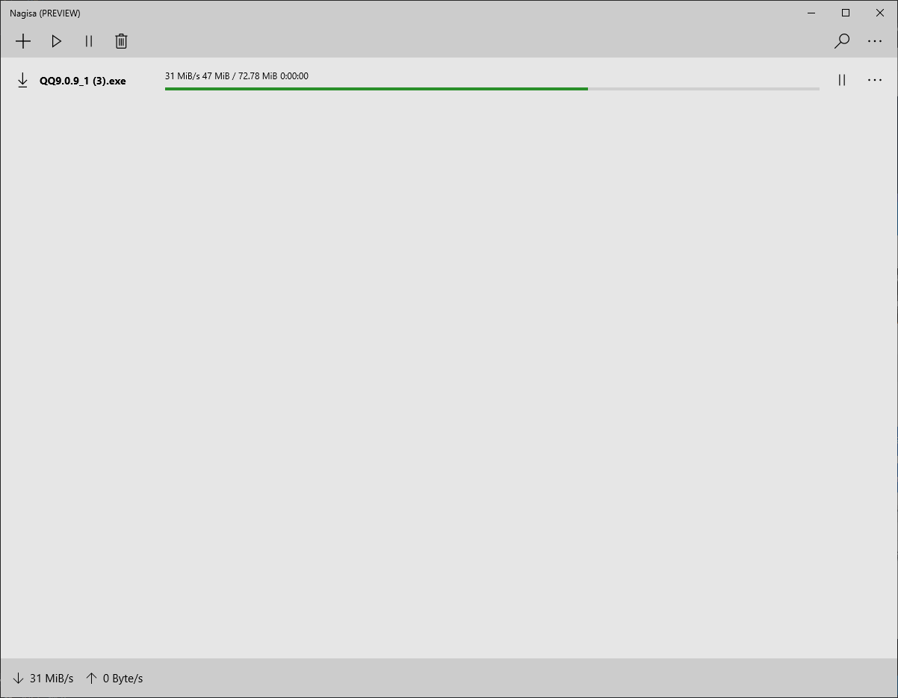

# Nagisa - One of Download Utilities for Windows Universal Platform.
 
[![release.badge]][release.link]
[![latestdownloads.badge]][latestdownloads.link]
[![totaldownloads.badge]][totaldownloads.link]
[![license.badge]][license.link]
[![donate.badge]][donate.link]

**Warning: This project is in the preview stage until the 1.0 is released.**

Nagisa is an open source download utility that supports multi languages. 
Running in the Windows Universal Platform, its distributed under the MIT 
License.

Nagisa is written in C++/CX and uses pure WinRT API, Win32 API, WRL and STL 
which ensures a higher execution speed and smaller program size. By optimizing
as many routines as possible without losing user friendliness, Nagisa is trying
to reduce the world carbon dioxide emissions. When using less CPU power, the PC
can throttle down and reduce power consumption, resulting in a greener 
environment.

You're encouraged to translate Nagisa into your native language if there's not 
already a translation present in the Nagisa's GitHub Repository.

> P.S. The above introduction is inspired by the Notepad++ project.

# System Requirement
- Supported OS Version: Windows 10 Build 10240 or later
- Support Platforms: x86, x86-64(AMD64), ARM and ARM64.

# Finished Features
- Supported Transfer Protocols: HTTP, HTTPS, FTP, FTPS, WebSocket and WebSocket
  Secure. (Temporarily Based on Windows.Networking.BackgroundTransfer)
- Muitl-language Support: English and Simplified Chinese.
- Support background download. 
  (Temporarily Based on Windows.Networking.BackgroundTransfer)
- Support resume broken/dead downloads.
  (Temporarily Based on Windows.Networking.BackgroundTransfer)
- Support single-threaded multi-tasking download.
  (Temporarily Based on Windows.Networking.BackgroundTransfer)

# Unfininshed Features
- Cortana Integration
- SFTP Support
- BitTorrent Support
- ED2K Support

# How to contribute the code for Nagisa
- You should send an e-mail to Mouri_Naruto@Outlook.com first.

# Documents
- [Nagisa's License](LICENSE)
- [Nagisa's Changelog](Changelog.md)
- [Nagisa's Relevant People](People.md)
- [Nagisa's Privacy Policy](Privacy.md)
- [Nagisa's Windows Store](https://www.microsoft.com/store/apps/9NFW53N9MFJR)

[release.badge]: https://img.shields.io/github/release/Project-Nagisa/Nagisa.svg
[release.link]: https://github.com/Project-Nagisa/Nagisa/releases/latest
[latestdownloads.badge]: https://img.shields.io/github/downloads/Project-Nagisa/Nagisa/latest/total.svg
[latestdownloads.link]: https://github.com/Project-Nagisa/Nagisa/releases/latest
[totaldownloads.badge]: https://img.shields.io/github/downloads/Project-Nagisa/Nagisa/total.svg
[totaldownloads.link]: https://github.com/Project-Nagisa/Nagisa/releases
[license.badge]: https://img.shields.io/github/license/Project-Nagisa/Nagisa.svg
[license.link]: LICENSE
[donate.badge]: https://img.shields.io/badge/PayPal-Donate-blue.svg
[donate.link]: https://www.paypal.me/MouriNaruto
